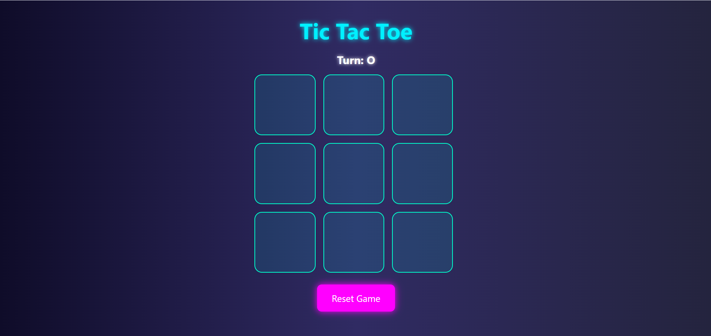

# 🎮 Neon Tic-Tac-Toe Game

A visually appealing **Tic-Tac-Toe** game built with **HTML, CSS, and JavaScript**. This version features a neon-inspired UI, responsive layout, and smooth game interactions.

## ✨ Features

- 🔲 3x3 grid game logic
- ❌🟢 Colored X and O (Red for X, Green for O)
- 🔁 Reset & New Game buttons
- 🎉 Win and Draw messages
- 🌈 Stylish neon theme and responsive design
- 🔄 Turn indicator

## 🖼️ Screenshot

## 🚀 How to Run

1. Clone the repo or download the files.
2. Open `index.html` in your browser.
3. Start playing!

## 🛠️ Technologies Used

- HTML5
- CSS3 (Flexbox, Grid, Gradients, Neon effects)
- JavaScript (Vanilla DOM manipulation)

## 📦 Future Improvements

- Add sound effects 🎵
- Add player vs AI mode 🤖
- Save scores with local storage 💾
- Multiplayer with socket.io (online mode) 🌐

## 🧑‍💻 Author

Made with ❤️ by Pratik  
Feel free to use, modify, or contribute!

